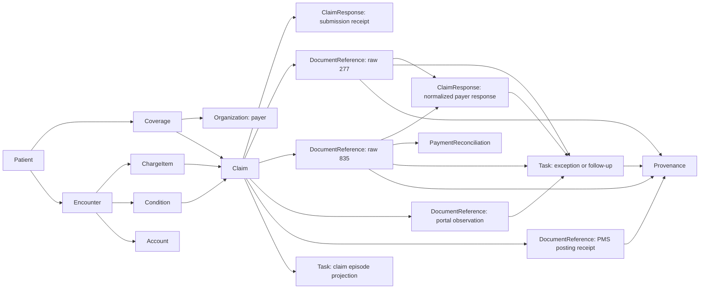

# Data and agent architecture

## 책임 분리

| 레이어 | 책임 | 책임이 아닌 것 |
|---|---|---|
| Web PMS | Practice dashboard, queue, claim workbench, conversational agent UI, approval | Secret 보관, payer source of truth |
| Overturn domain | Source observation 정규화, discrepancy 판정, claim episode, human approval policy, verified-paid | 범용 agent runtime |
| Session repository | Cookie-scoped snapshot, append-only events, conversations, action reservations (memory / SQLite / D1) | Cross-session shared ledger |
| Breakfast Factory | Agent thread, run, event stream, model execution | 의료 데이터 source of truth, payer mutation proof |
| Medplum | FHIR R4 resource, Task workflow, evidence reference, Provenance, access control | Payer portal 자동화 |
| Stedi | 837P transport, 277CA, 835 ERA transport (connected path limitations explicit) | PMS, denial resolution |
| Moss | Claim-scoped semantic evidence retrieval and low-latency voice guidance | Healthcare source of truth, action authorization |

## Session isolation

Anonymous browser sessions receive an opaque `hv_demo_session` HttpOnly cookie.
Each session has its own event ledger and snapshot. Reset restores only that
session. Local verify uses in-memory or SQLite repositories. Sites durable path
uses D1 via `.openai/hosting.json` binding `DB`.

## Conversational agent boundary

Questions never perform healthcare writes. Submit, reprocessing, correction,
and document-send requests create only a deterministic server-built proposal.
Allow once / Deny remains the sole healthcare write path with exact scope,
stale-revision conflict, and idempotent retries. Claim B is the intentional
exception for a read-only payer status refresh: chat may run that query directly,
append the returned observation and follow-up, and never mark the claim paid.

When Moss is configured, every turn also queries a synthetic-only operational
evidence index. The server adds the current claim context, rejects every result
whose metadata does not match the active episode, and uses the surviving order
only to rank citations already present in the durable episode. Retrieved text
cannot create a proposal, approve an action, or mutate healthcare state.

The public Worker calls a bearer-authenticated AWS Node sidecar because the
official Moss SDK uses native binaries. The sidecar loads the index and embedding
model into a persistent local cache, applies the exact episode metadata filter,
and returns only the normalized retrieval contract. Moss project credentials
never enter the Worker, browser, logs, or repository.

## FHIR graph



Verified paid requires independent Raw835/ERA evidence AND independent PMS
posting DocumentReference with exact claim/control and amount agreement.
PaymentReconciliation alone never proves posting.

## Resource 역할

| FHIR R4 resource | 사용 목적 | 중요한 제한 |
|---|---|---|
| `Patient` | Synthetic patient identity | 실제 PHI 금지 |
| `Coverage` | Member, subscriber, plan, payer 연결 | `subscriberId`, `payor`, `class` 등 표준 필드 사용 |
| `Organization` | Practice, payer | 외부 payer identifier 체계는 adapter가 소유 |
| `Encounter` | 실제 방문 | `Appointment`는 예약이며 실제 방문과 구분 |
| `Provenance` | Signed chart, normalized resource의 derivation, agent와 승인자 | Claim lifecycle store로 사용하지 않음 |
| `ChargeItem` | CPT 또는 HCPCS service line 원재료 | `Encounter`와 `Account` 연결 |
| `Condition` | ICD-10 diagnosis source | 임의 diagnosis code 발명 금지 |
| `Account` | Patient 또는 episode financial anchor | R4 `Account`에 계산된 balance 필드를 발명하지 않음 |
| `Claim` | 제출할 claim version | Corrected claim은 새 resource로 만들고 `Claim.related`로 원본 연결 |
| `ClaimResponse` | Submission receipt 또는 normalized payer adjudication | 두 의미를 별도 kind로 구분. Submission `outcome=complete`는 payer accepted 또는 paid가 아님 |
| `DocumentReference` | Raw 277, raw 835, ERA PDF, portal snapshot, supporting artifact | 원본은 immutable evidence로 취급 |
| `PaymentReconciliation` | 835 payment allocation의 정규화 | Bank deposit settlement 증명은 아님 |
| `Task` | Claim episode와 exception work queue projection | 단일 claim status를 대신하지 않으며 source observation을 덮어쓰지 않음 |
| `AuditEvent` | Access, execution, security audit | Workflow state store로 사용하지 않음 |

## Current Medplum and Stedi boundary

현재 Medplum Stedi integration의 실제 동작과 목표 모델을 구분한다.

### 현재 동작

- 837P submit operation은 `Claim`에 correlation identifier를 남기고 submission `ClaimResponse`를 만든다.
- 이후 inbound 277CA와 835는 원문 JSON을 `DocumentReference`로 저장한다.
- 835 ERA PDF도 best-effort로 `DocumentReference`에 저장한다.
- Existing submission `ClaimResponse`에 raw response document link를 best-effort로 추가한다.
- Inbound Stedi transaction ID를 기준으로 idempotent하다.
- Current integration은 raw response에서 payer adjudication `ClaimResponse` 또는 `PaymentReconciliation`을 자동 생성하지 않는다.
- Real-time 276/277 claim status와 payer portal 조회는 현재 범위가 아니다.

### 이번 제품이 추가하는 것

- `response-normalizer`: raw 277와 835를 읽고 normalized observation과 financial projection을 만든다.
- `discrepancy-engine`: source conflict와 missing expected event를 deterministic rule로 판정한다.
- `claim-episode-projector`: Encounter부터 posting까지 여러 상태 축을 UI용 view model로 계산한다.
- `agent-context-builder`: 현재 exception과 직접 연결된 evidence만 BFF run context로 구성한다.
- `approved-action-runner`: one-time approval receipt가 있을 때만 external adapter를 호출한다.

## 상태 축

```ts
type EncounterState =
  | "scheduled"
  | "arrived"
  | "completed"
  | "note_signed";

type ChargeState =
  | "uncoded"
  | "coding_blocked"
  | "ready"
  | "claim_created";

type TransportState =
  | "unsent"
  | "sent"
  | "clearinghouse_received"
  | "clearinghouse_rejected"
  | "payer_delivered";

type AdjudicationState =
  | "not_found"
  | "accepted_for_processing"
  | "pending"
  | "info_requested"
  | "denied"
  | "partial"
  | "paid";

type RemittanceState = "none" | "expected" | "received";
type SettlementState = "unknown" | "pending" | "received" | "failed";
type PostingState = "unposted" | "posted" | "reconciled" | "mismatch";
type ResolutionState =
  | "monitoring"
  | "investigating"
  | "waiting_on_practice"
  | "waiting_on_payer"
  | "approval_required"
  | "corrected"
  | "rebilled"
  | "reprocessing"
  | "appealed"
  | "closed";
```

`settlement_state`는 향후 bank/EFT connector를 위한 경계다. 이번 데모에서는 `unknown` 또는 `received` synthetic value를 표시하되 verified paid KPI의 필수 조건으로 사용하지 않는다. 이번 데모의 검증 가능한 종료 상태는 remittance received와 posting reconciled다.

## Source observation

모든 source status는 normalized projection과 원문 근거를 함께 가진다.

```ts
interface SourceObservation {
  id: string;
  episodeId: string;
  source: "pms" | "clearinghouse" | "payer" | "remittance" | "posting";
  rawStatus: string;
  normalizedStatus: string;
  observedAt: string;
  lastVerifiedAt: string;
  evidenceReference: string;
  synthetic: boolean;
}
```

Agent가 observation을 수정하지 않는다. 새 observation과 append-only event를 추가하고 projection을 다시 계산한다.

## Claim episode

Claim episode는 다음 identity를 잇는다.

```text
Encounter
  -> Claim version
  -> submission correlation ID
  -> payer claim ID
  -> raw response documents
  -> normalized response
  -> remittance and posting
  -> action attempts and follow-ups
```

각 nonterminal episode는 반드시 `owner`, `next action`, `next follow-up` 또는 명시적인 `blocker`를 가진다.

## Discrepancy rules

첫 버전은 model 판단이 아닌 deterministic rule을 사용한다.

### status_conflict

같은 claim episode의 최신 PMS observation과 더 최신 payer observation의 normalized adjudication이 충돌한다.

예:

```text
PMS: processing at 2026-07-01
Payer: denied, authorization required at 2026-07-10
```

### status_stale

Payer accepted 또는 processing 이후 practice 또는 payer별 `next_follow_up_at`이 지났지만 새 payer, remittance observation이 없다.

### payment_unverified

Payer 또는 835 evidence는 paid를 나타내지만 linked remittance normalization 또는 posting reconciliation이 없다. UI에서는 `Paid, needs posting`으로 표현한다.

## Agent contract

Agent는 다음 단계로 동작한다.

1. Read: Claim episode와 직접 연결된 source evidence를 읽는다.
2. Explain: 어떤 source가 언제 무엇을 말했고 무엇이 빠졌는지 설명한다.
3. Propose: correction, reprocessing, document request, follow-up, appeal 중 evidence에 맞는 다음 행동 하나를 제안한다.
4. Draft: 외부 제출 전에 사용자가 검토할 artifact를 만든다.
5. Approve once: action type, target, payload digest, expiry를 묶은 일회성 승인 receipt를 받는다.
6. Execute: adapter가 idempotency key와 함께 실행한다.
7. Verify: execution receipt를 evidence로 남기고 next follow-up을 만든다.

Irreversible external action을 agent가 자율 실행하지 않는다. Read, compare, explain, draft는 자동 수행할 수 있다.

## Adapter modes

동일한 domain interface 아래 세 mode를 둔다.

### Demo mode

- Synthetic FHIR Bundle과 deterministic agent adapter를 사용한다.
- Browser E2E에서 완전 재현 가능하다.
- 모든 payer observation에 synthetic label을 표시한다.

### Connected Medplum mode

- Server-side Medplum client가 FHIR resource를 create, search, update한다.
- Browser에 client secret 또는 access token을 전달하지 않는다.
- Connection failure는 demo data로 조용히 fallback하지 않고 화면에 mode와 오류를 표시한다.

### Connected BFF mode

- Server-side BFF proxy가 thread, run, SSE event stream과 conversational intent classification을 제공한다.
- Grounded answer, citation, proposal은 server domain code가 재구성한다. Model output은 상태를 바꾸지 않는다.
- Healthcare `local` + agent `bff` 공개 데모에서는 ActionService가 독립 synthetic executor로 mutation receipt를 증명한다. BFF `run_completed`만으로는 domain success receipt를 만들지 않는다.
- BFF unavailable일 때 conversational fallback을 숨기지 않는다. Demo synthetic agent mode에서만 deterministic chat를 사용한다.

## Guided hero claim (encounter-a)과 tool job

Encounter-a는 정적 proposal 하나가 아니라 `visit_ready` → `appeal_submitted`까지
이어지는 단일 hero stage machine(`src/domain/hero.ts`)을 사용한다. 각 단계는
서버 소유 정책(`src/domain/action-policy.ts`, `src/server/tool-jobs.ts`)이
게이트하며, `heroStage`는 UI hint일 뿐이고 실제 진행은 항상 durable connector
receipt(`portalInvestigationReceiptId`, `voiceSessionReceiptId`,
`reprocessingReceiptId`, `denialUpheldReceiptId`, `appealReceiptId`)로
`deriveHeroStage`가 재계산한다.

### Tool job

Portal investigation, voice session, denial recheck는 approval이 필요 없는
고정 action tool job(`ToolJobService`)이다. Idempotency key, ordered progress,
revision fencing을 가지며, connector receipt가 episode에 적용된 이후에만
`heroStage`가 전진한다. `POST /api/demo/reset`은 `repo.reset()` 이전에 active
tool job을 먼저 취소하며, 취소가 실패하면 409를 반환하고 reset을 진행하지
않는다.

Formal appeal(`submit_appeal`)만 예외로, approval-gated action이면서 내부적으로
동일한 tool job 경로(`runApprovalGatedToolJob`)를 실행한다. 이 경로는 receipt가
아직 없는 재시도(연결 오류, pending job)를 매번 새로 제출하지 않고 같은 remote
job을 poll/reconcile하며, 확인 번호(confirmation)가 도착한 시점에만 approval을
소비하고 Provenance/AuditEvent를 만든다.

### 자동화 sidecar

Portal 자동화와 Deepgram voice session은 이 Next.js 앱이 아니라
`services/automation-sidecar`가 소유한다. `AUTOMATION_SIDECAR_URL` /
`AUTOMATION_SIDECAR_API_KEY`가 설정되지 않으면 in-process mock sidecar로
fallback하며, 로컬 개발과 `npm run verify`는 이 sidecar를 요구하지 않는다.
Deepgram API key는 이 앱의 환경이 아니라 sidecar 자체 환경에만 존재하고, 실제
전화망(PSTN) 연결은 이 데모 어디에도 없다 — voice session은 항상 scripted
synthetic payer audio 위에서 동작한다.

### Eligibility와 claim submission의 구분

- Eligibility(270/271)만 `stediMode=test` + `STEDI_API_KEY`가 있을 때 실제 Stedi
  test-mode API를 호출한다. 결과는 정규화된 요약(checkId, activeCoverage,
  activeBenefitCount, planNames, hasRaw271 flag)만 episode에 영구 저장하며,
  raw X12는 절대 저장하지 않는다. Rate limit과 idempotency(이미
  `eligibilityReceiptId`가 있으면 재호출하지 않음)로 보호된다.
- Claim 제출(submit_claim, 그리고 hero flow 전체)은 항상 simulated Stedi
  clearinghouse rail이다 — 실제 837P는 이 데모 어디에도 없다.

### Medplum optional

FHIR write-through plane(`src/server/fhir-plane.ts`)은 session ledger와 완전히
분리된 additive layer다. `HEALTHCARE_MODE=medplum`이 아니거나 `MEDPLUM_*`가
없으면 `disabled` badge를 표시하고, 설정되었지만 연결에 실패하면 `unavailable`
badge를 표시한다 — 어느 경우에도 session 상태나 guided hero claim 진행에는
영향을 주지 않으며, 조용한 fallback은 없다.

## Idempotency와 승인

- Claim submission, corrected claim, reprocessing request는 각각 안정적인 idempotency key를 가진다.
- 승인 receipt는 exact action과 payload digest에만 유효하며 재사용하지 않는다.
- Submit click, ambiguous timeout, disconnected stream을 성공으로 해석하지 않는다.
- Retry는 같은 idempotency key를 사용하고 새 실행 receipt가 성공을 증명할 때만 상태를 전환한다.

## 실패 경로

| 실패 | 화면과 상태 |
|---|---|
| Medplum unavailable | Connected mode error, last successful observation time, retry. Silent demo fallback 금지 |
| BFF unavailable | Agent run failure와 retry. Approved external action 미실행 |
| Stedi timeout | Submission pending verification. Submitted KPI 미집계 |
| Duplicate webhook | Inbound transaction ID로 no-op |
| Raw response parse 실패 | Evidence 보존, normalization-failed exception Task 생성 |
| Source timestamp 역전 | Latest observed time을 기준으로 projection하고 late-arrival event 표시 |
| User denies approval | External adapter 미호출, proposal declined event 기록 |
| Refresh 또는 interruption | Persisted episode와 event stream cursor로 복원 |
| Reset demo | Synthetic seed revision으로 원자적 초기화 |

## Privacy와 access

- Synthetic data only.
- Practice 하나당 Medplum project 하나를 초기 경계로 사용한다.
- Biller user, normalization Bot, BFF ClientApplication의 AccessPolicy를 분리한다.
- Browser bundle과 network response에 secret을 포함하지 않는다.
- Prompt context는 현재 claim episode에 직접 연결된 최소 evidence만 포함한다.
- Raw interview image, transcript, customer identifier를 product asset 또는 agent context에 포함하지 않는다.
